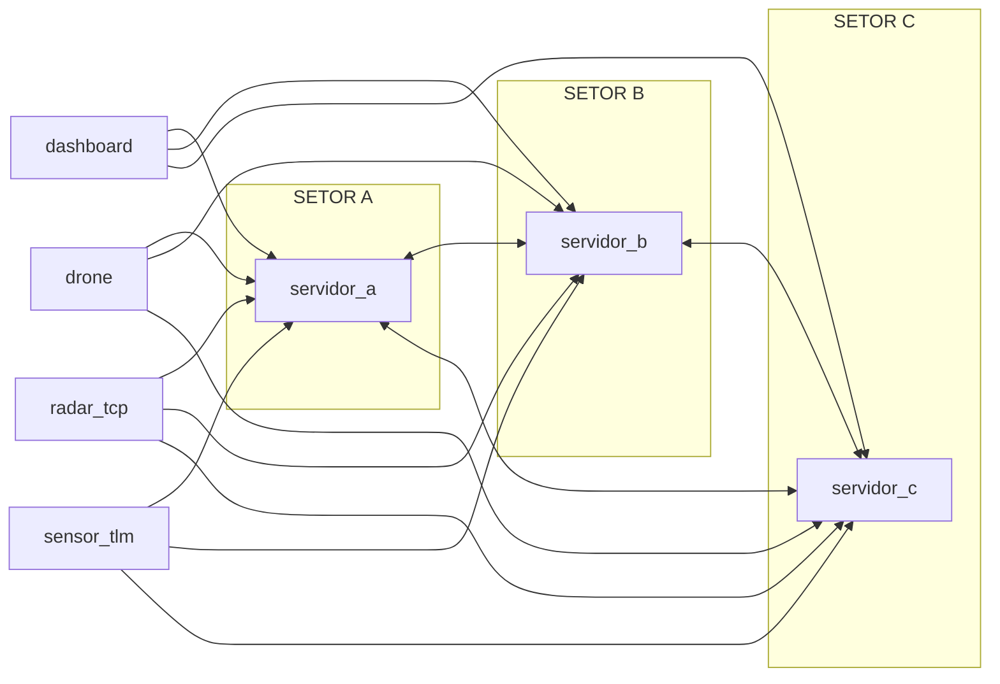

# PBL 2 - Redes: Desbloqueio do Estreito de Ormuz

Projeto da disciplina de Conectividade e Concorrencia com arquitetura distribuida orientada a eventos, usando Go, TCP/UDP e Docker.

A implementacao atual modela uma rede de vigilancia maritima com tres servidores de setor (P2P), sensores, drones e um painel de operacao com failover automatico.

## Topicos

- Visao geral
- Objetivos tecnicos
- Arquitetura atual
- Componentes do sistema
- Tecnologias utilizadas
- Protocolo de mensagens
- Conectividade e portas
- Tolerancia a falhas e resiliencia
- Estrutura do projeto
- Como executar com Docker Compose
- Como executar por setor (manual)
- Testes de stress com imagens Docker Hub
- Comandos uteis
- Fluxo de desenvolvimento e publicacao

---

## Visao geral

A solucao separa infraestrutura de rede, consenso distribuido e operacao:

- Servidores de setor (`servidor`) mantem estado local, participam da malha P2P e coordenam despacho de drones.
- Dashboard (`dashboard`) permite monitorar frota, telemetria e alertas, e emitir despacho manual.
- Drones (`drone`) registram-se no servidor e executam missoes.
- Sensor critico (`radar_tcp`) envia eventos de alerta via TCP.
- Sensor de telemetria (`sensor_tlm`) envia leituras continuas via UDP.

A arquitetura suporta um ou multiplos setores, com failover de cliente por lista de enderecos (`SERVER_ADDRS`).

---

## Objetivos tecnicos

- Disponibilidade: clientes alternam automaticamente entre servidores de contingencia.
- Escalabilidade horizontal: multiplos setores com gossip e sincronizacao de frota.
- Robustez operacional: reconexao automatica e tolerancia a desconexao parcial.
- Simplicidade de deploy: cada componente encapsulado em container.

---

## Arquitetura atual



Notas:

- O trafego entre servidores ocorre na porta `8084/tcp` (rede interna Docker).
- Clientes usam `SERVER_ADDRS` para failover round-robin.

---

## Componentes do sistema

1. `servidor`
- Recebe telemetria UDP (`8080`) e eventos TCP (`8081`).
- Recebe drones (`8082`) e dashboard (`8083`).
- Mantem malha P2P (`8084`) para consenso e gossip.
- Coordena despacho com Ricart-Agrawala entre setores.

2. `dashboard`
- Mantem conexao TCP com servidor de setor.
- Exibe frota global e historico de alertas/telemetria.
- Permite solicitar missao manual (`CMD`).
- Faz failover automatico entre servidores da lista.

3. `drone`
- Registra-se com `REG` e publica estado com `ACK`.
- Recebe `CMD` de despacho e simula missao.
- Faz failover automatico entre servidores da lista.

4. `radar_tcp`
- Publica eventos criticos (`EVT`) via TCP.
- Suporta perfis de sensor (`RADAR`, `AIS`, `QUIMICO`).
- Faz failover automatico entre servidores da lista.

5. `sensor_tlm`
- Publica telemetria (`TLM`) via UDP.
- Recria socket e alterna servidor em falha de envio.

---

## Tecnologias utilizadas

- Linguagem: Go 1.25
- Transporte: TCP e UDP
- Serializacao: JSON
- Concorrencia: goroutines, mutexes, canais
- Consenso distribuido: Ricart-Agrawala
- Sincronizacao de estado: gossip P2P
- Containerizacao: Docker
- Orquestracao local: Docker Compose

---

## Protocolo de mensagens

Mensagens principais:

- `REG`: registro de componente (drone/dashboard).
- `CMD`: comando de despacho.
- `ACK`: confirmacao e estado de drone.
- `EVT`: evento critico de sensor (alerta).
- `TLM`: telemetria numerica.
- `P2P_HELLO`: descoberta de vizinho.
- `P2P_REQ`: pedido de exclusao mutua.
- `P2P_CMD`: ordem remota de despacho em outro setor.
- `ACK` (P2P): autorizacao no consenso.
- `GOSSIP`: sincronizacao da frota entre setores e dashboards.

Formato (campos podem ser opcionais por tipo):

- `tipo`
- `remetente`
- `destino`
- `relogio`
- `acao`
- `valor`
- `posicao`
- `frota`

---

## Conectividade e portas

### Portas internas do servidor (container)

| Protocolo | Porta | Uso |
| --- | --- | --- |
| UDP | 8080 | Entrada de telemetria (`sensor_tlm`) |
| TCP | 8081 | Entrada de eventos (`radar_tcp`) |
| TCP | 8082 | Registro e controle de drones |
| TCP | 8083 | Conexao do dashboard |
| TCP | 8084 | Malha P2P entre servidores |

### Mapeamento no host (compose com 3 setores)

| Setor | UDP 8080 | TCP 8081 | TCP 8082 | TCP 8083 |
| --- | --- | --- | --- | --- |
| A | 8080 | 8081 | 8082 | 8083 |
| B | 8090 | 8091 | 8092 | 8093 |
| C | 8100 | 8101 | 8102 | 8103 |

---

## Tolerancia a falhas e resiliencia

1. Failover de clientes (dashboard, drone, radar_tcp)
- Enderecos em `SERVER_ADDRS` com rotacao round-robin.
- Queda de um servidor dispara troca para o proximo endereco.

2. Failover de cliente UDP (`sensor_tlm`)
- Em erro de `Write`, reconecta para o proximo servidor da lista.

3. Reconexao automatica
- Todos os clientes mantem laço de reconexao sem encerrar processo.

4. KeepAlive TCP
- Conexoes TCP habilitam keepalive para reduzir conexoes zumbi.

5. Gossip de estado
- Servidores propagam estado da frota para manter visao convergente.

6. Consenso distribuido
- Ricart-Agrawala evita disputa concorrente por drones entre setores.

7. Degradacao parcial
- Com um setor indisponivel, clientes seguem operando pelos demais.

---

## Estrutura do projeto

```text
.
├── docker-compose.yml
├── README.md
├── arquivos_sh/
│   ├── cleanup.sh
│   ├── run_servidor.sh
│   ├── stress_atuadores.sh
│   ├── stress_clientes.sh
│   └── stress_sensores.sh
├── dashboard/
│   ├── Dockerfile
│   ├── go.mod
│   └── main.go
├── drone/
│   ├── Dockerfile
│   ├── go.mod
│   └── main.go
├── radar_tcp/
│   ├── Dockerfile
│   ├── go.mod
│   └── main.go
├── sensor_tlm/
│   ├── Dockerfile
│   ├── go.mod
│   └── main.go
└── servidor/
    ├── Dockerfile
    ├── go.modh
    └── main.go
```

---

## Como executar com Docker Compose

Subir toda a arquitetura local de 3 setores:

```bash
docker compose up -d --build
```

Abrir o dashboard interativo:

```bash
docker attach dashboard_operador
```

Sair sem derrubar o container:

- `Ctrl+P`, depois `Ctrl+Q`

---

## Como executar por setor (manual)

Script de servidor:

```bash
NOME_SETOR=SETOR_NORTE ./arquivos_sh/run_servidor.sh
```

Variaveis uteis:

- `NOME_SETOR` (ex.: `SETOR_A`, `SETOR_B`)
- `PEERS` (ex.: `10.0.0.11:8084,10.0.0.12:8084`)

---

## Testes de stress com imagens Docker Hub

Os scripts de stress usam imagens publicadas no Docker Hub e suportam sobrescrita por variavel.

### Scripts

- `arquivos_sh/stress_sensores.sh`
- `arquivos_sh/stress_atuadores.sh`
- `arquivos_sh/stress_clientes.sh`
- `arquivos_sh/cleanup.sh`

### Variaveis de ambiente (exemplos)

Com tres gateways distintos:

```bash
export IP_GATEWAY1=172.16.103.8
export IP_GATEWAY2=172.16.103.9
export IP_GATEWAY3=172.16.103.10
```

Quantidade de instancias:

```bash
export QTD_SALAS=50
```

Imagens Docker Hub (defaults atuais):

- `IMG_SENSOR_TLM=cleidsonramos/sensor_tlm:latest`
- `IMG_RADAR_TCP=cleidsonramos/radar_tcp:latest`
- `IMG_DRONE=cleidsonramos/drone:latest`
- `IMG_DASHBOARD=cleidsonramos/dashboard:latest`

Execucao:

```bash
bash arquivos_sh/stress_sensores.sh
bash arquivos_sh/stress_atuadores.sh
bash arquivos_sh/stress_clientes.sh
```

Limpeza:

```bash
bash arquivos_sh/cleanup.sh
```

---

## Comandos uteis

Estado geral:

```bash
docker compose ps
docker ps --format 'table {{.Names}}\t{{.Status}}\t{{.Ports}}'
```

Logs por componente:

```bash
docker logs -f servidor_ormuz_a
docker logs -f servidor_ormuz_b
docker logs -f servidor_ormuz_c
docker logs -f drone_01
docker logs -f dashboard_operador
```

Teste rapido de failover:

```bash
docker logs -f drone_01
docker stop servidor_ormuz_a
```

Parar tudo:

```bash
docker compose down
```

Rebuild completo:

```bash
docker compose up -d --build
```

---

## Fluxo de desenvolvimento e publicacao

Build local por servico:

```bash
docker build -t cleidsonramos/servidor:latest ./servidor
docker build -t cleidsonramos/dashboard:latest ./dashboard
docker build -t cleidsonramos/drone:latest ./drone
docker build -t cleidsonramos/radar_tcp:latest ./radar_tcp
docker build -t cleidsonramos/sensor_tlm:latest ./sensor_tlm
```

Push para Docker Hub:

```bash
docker push cleidsonramos/servidor:latest
docker push cleidsonramos/dashboard:latest
docker push cleidsonramos/drone:latest
docker push cleidsonramos/radar_tcp:latest
docker push cleidsonramos/sensor_tlm:latest
```

---

## Observacoes finais

- Para ambiente de apresentacao com multiplas maquinas, prefira IP fixo e porta padronizada por setor.
- Se quiser validar apenas um caminho, comece por: `servidor + drone + radar + dashboard`.
- Em cenarios com perda de no, verifique logs de reconexao e de gossip para confirmar convergencia.
